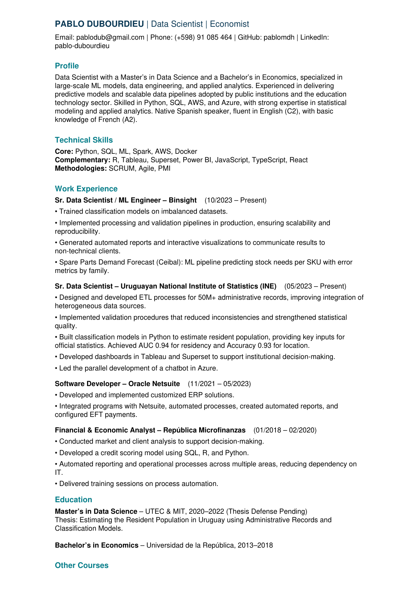

# Pablo Dubourdieu – Data Scientist | Economist

---

## About Me
Data Scientist with a Master’s in Data Science and a Bachelor’s in Economics.
Specialized in large-scale ML, data pipelines, and applied analytics. Experienced in
delivering predictive models for national statistics and the education technology sector.

---

## Featured Projects
- [Residency Indicator – National Statistics](https://github.com/pablomdh/poblacion_por_registros)
  

- <!-- - [Remote Sensing & Vegetation Index Forecast](projects/remote-sensing) -->
---

